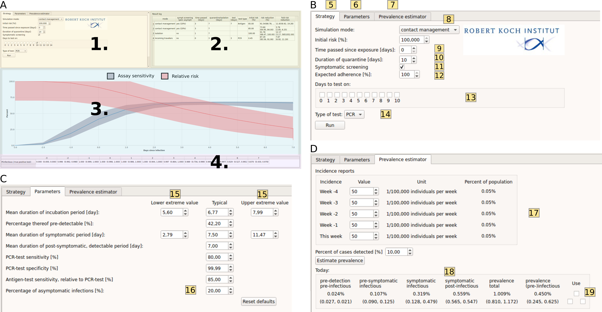

# CovidStrategyCalculator
A standalone GUI to assess SARS-CoV2 testing- and  quarantine  strategies for incoming travelers, contact person management and de-isolation.

The CovidStrategyCalculator (CSC) calculates the residual risk, risk reduction and test efficacy for arbitrary testing and  quarantine strategies. Where risk is defined as the probability that an individual, who is released from quarantine/isolation, is- or may become infectious and potentially spread the disease.

Underneath, we implemented the analytical solution of a stochastic transit compartment model of the infection time course that captures published temporal changes and variability in test sensitivities, incubation- and infectious periods, as well as times to symptom onset. The infection time course is modeled using five compartments: a pre-detection phase (not infectious, negative PCR), a pre-symptomatic phase (infectious, positive PCR), a symptomatic infectious phase (positive PCR), a post-infectious phase (symptomatic, positive PCR) and a post-detection phase (not infectious, negative PCR).

The software allows full flexibility with regards to parameter choices, that, for example, determine the time-course of infection, the proportion of asymptomatic cases and the test sensitivity and much more. However, a set of default parameters is provided, that has been carefully derived by fitting the model’s parameters to available clinical and in-house data on the incubation time, the off-set of infectiousness after symptom onset or peak virus load, as well as the time-dependent test sensitivities.

## Software utilization

*Figure 1. Screenshot of CovidStrategyCalculator. A. The main window consists of four components: user input (1), a result log (2), time course trajectories (3) and test efficacy reports (4). Reported results include the pre-procedure risk (prevalence), post-procedure risk (residual risk) and fold risk reduction. B. Zoom-in on the strategy-related user input. C. Model parameter input tab. D. Prevalence estimator input tab.*

The emphasis in software design has been put on combining ease-of-use with maximal flexibility.  Figure 1A shows a screenshot of the strategy evaluation window of the tool, where the user can define what he/she wants to analyse, e.g. an arbitrary strategy (1). Simulating a chosen strategy, will depict the results table (2) and graphics regarding the assay sensitivity and relative risk profile (3), as well as numeric values regarding the time-dependent assay sensitivity (4) to ease the selection of times to perform diagnostic tests.

Figure 1B shows a zoom of the opening window: The different tabs allow to evaluate a strategy (5), set parameters (6) or perform a prevalence estimation (7).  In field (8), the user can select between the different modi of the software; i.e. to assess quarantine- and testing strategies for (i) contact management (known time of exposure), for (ii) incoming travelers from high-risk areas (unknown time of exposure), as well as to evaluate (iii) de-isolation strategies.

In the **contact management mode**, the user sets the time passed since the putative infection (9), a duration of quarantine (10) and whether symptom screening is performed (checkbox in 11). Symptom screening would imply that an individual who develops symptoms is not released into society, but rather goes into isolation. The expected level of adherence to the chosen strategy can be set in (12). The user can also decide on whether diagnostic tests should be conducted during the quarantine time (check-boxes in 13), and if so, whether PCR-tests or antigen-based rapid diagnostic testing (RDT) should be performed. Pressing ‘run’ will then evaluate this user-defined strategy and depict the results in terms of the residual risk and the fold risk reduction in a table format on the right (field 2. in Figure 1A).

When choosing the **incoming travelers mode** (field (8) in Figure 1B), the user is taken to the prevalence estimation subroutine of the software, Figure 1D: The user provides the incidence history of the past 5 weeks in the travelers’ origin country (17) and an estimate of the presumed proportion of cases that are actually detected (18). The button ‘estimate prevalence’ will estimate the prevalence, as well as the infection states that the traveler is likely to be in. By checking the box ‘use’ (19), the estimated prevalence will be used as initial condition for the quarantine strategy, Figure 1B, where the user can proceed as described above.

In the **isolation mode**, the user can test strategies for the duration of isolation of infected individuals. The user’s options are similar to the modi described above, with the exception that a symptomatic screening is not possible (individuals in isolation are confirmed infected or have symptoms) and that the isolated individual starts in the infectious (symptomatic) phase.

In addition to these features, a user can  jump straight to the **prevalence estimator**, field (7) in Figure 1B or freely change the models’ default parameters (clicking on field (6) in Figure 1B will show the window depicted in Figure 1C) to customize the model. Figure 1C shows the model parameter input tab. Uncertainty ranges are calculated based on the extreme parameter values provided by the user (15). The percentage of asymptomatic cases also be defined by the user (16).

## Building from source
The CSC application can be compiled from source using the Qt5 framework. CSC requires the Eigen 3.3.7 library. When building from source, the path to the Eigen source code (root folder) has to be set in the
`src/CovidTestCalculator.pro` file:

```{c}
INCLUDEPATH += path/to/eigen
```
### Versions
This application was developed using:
* Eigen 3.3.7 (`https://gitlab.com/libeigen/eigen/-/releases#3.3.7`)
* Qt 5.9.5 (`https://download.qt.io/archive/qt/5.12/5.12.9/`)

Other versions of these two libraries might work, but have not been tested.
