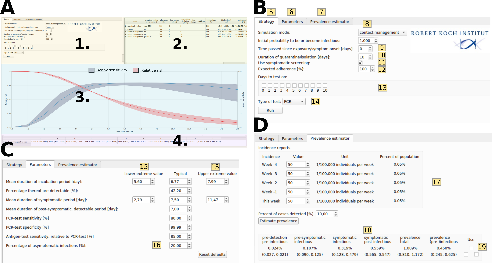

# COVIDStrategyCalculator
This repository contains the source code of the COVIDStrategyCalculator: A standalone software
to assess testing- and quarantine strategies for incoming travelers,
contact person management and de-isolation.

The COVIDStrategyCalculator implements a stochastic within-host viral dynamics model
[1](https://doi.org/10.1101/2020.11.18.20233825) that captures temporal attributes of the viral
infection, such as test sensitivity, infectiousness and the occurrence of symptoms. Based
on this model, the software allows to evaluate the efficacy of user-defined, arbitrary non-
pharmaceutical interventions (NPIs) and testing strategies in reducing the transmission
potential in different contexts.

**The COVIDStrategyCalculator can be found
[here](https://CovidStrategyCalculator.github.io). OPEN IN A PRIVATE BROWSER!** or delete your browser history for the website https://CovidStrategyCalculator.github.io regularly. This is important. 
The web version is best used on a full-sized screen (desktop/laptop). 
(Impressum: [here](https://CovidStrategyCalculator.github.io/impressum.html)).

If you have any questions or remarks, please open an issue or contact us via
[email](kleistm@rki.de).


## Non-pharmaceutical interventions
NPIs are important tools to prevent SARS-CoV-2 transmission and contain the spread of novel
variants. NPIs consist of quarantine, isolation and diagnostic testing of (potentially)
infected individuals. The term ‘quarantine’ refers to the separation of people who are at risk
of being infected with SARS-CoV-2 due to potential exposure, but whose infection status is
unknown. Examples include the management of incoming travelers from high-risk areas, or the
management of individuals who have been in contact with confirmed cases. The term ‘isolation’,
refers to the separation of individuals with a confirmed infection. NPI strategies may also
combine quarantine, isolation and SARS-CoV-2 testing to improve efficacy, or shorten quarantine
durations.


## Software outputs
The COVIDStrategyCalculator allows to compute the efficacy of user-defined NPI strategies.
Efficacy refers to reducing the transmission potential emanating from an individual (= ‘risk
reduction’): efficacy = risk reduction = 1 - relative risk.

Mathematically, the ‘relative risk’ is computed as the *residual transmission risk* that
remains after a user-defined NPI strategy, relative to the transmission risk in a baseline
scenario, where no NPIs are imposed (an example is given in the associated article
[1](https://doi.org/10.1101/2020.11.18.20233825), Fig. 2 therein).


where the nominator integrates over the conditional probability of being infectious after
release from an NPI (e.g. quarantine) at time t<sub>end</sub>, whereas the nominator integrates
over the probability of being infectious in the case where individuals had not been isolated,
or put into quarantine (baseline risk).

When simulating a user-defined NPI strategy, the profile of the % relative risk will be
depicted together with the time-dependent diagnostic assay sensitivity P(positive test |
infected)


## Software utilization
The COVIDStrategyCalculator has three modes of operation, corresponding to the three common
scenarios in policy making: (i) quarantine for contact management, (ii) isolation of infected
individuals and (iii) quarantine for incoming travelers. The modes differ in the initial
states used for simulation. In the ‘contact management’ and the ‘isolation’ mode, the
simulation starts from a point distribution, whereas in the ‘incoming travelers’ mode assumes
a mix of ‘infection ages’.  

COVIDStrategyCalculator allows full flexibility with regards to parameter choices of the
underlying model, that, for example, determine the time-course of infection (e.g. the average
“incubation time” or the “time of infectiousness”), the proportion of asymptomatic cases,
the test sensitivity and much more. However, a set of default parameters has been derived in
an associated article [1](https://doi.org/10.1101/2020.11.18.20233825) that synthesizes the
current knowledge on within-host infection dynamics of SARS-CoV-2 and temporal test
sensitivity.

For further details on the scientific methods and results we refer to the article, which can
be found [here](https://doi.org/10.1101/2020.11.18.20233825).


*Figure 1. Screenshot of CovidStrategyCalculator. A. The main window consists of four
components: user input (1), a result log (2), time course trajectories (3) and test efficacy
reports (4). Reported results include the pre-procedure risk (prevalence), post-procedure risk
(residual risk) and fold risk reduction. B. Zoom-in on the strategy-related user input. C.
Model parameter input tab. D. Prevalence estimator input tab.*

The emphasis in software design has been put on combining ease-of-use with maximal
flexibility.  Figure 1A shows a screenshot of the strategy evaluation window of the tool,
where the user can define what he/she wants to analyse, e.g. an arbitrary strategy (1).
Simulating a chosen strategy, will depict the results table (2) and graphics regarding the
assay sensitivity and relative risk profile (3), as well as numeric values regarding the time-
dependent assay sensitivity (4) to ease the selection of times to perform diagnostic tests.

Figure 1B shows a zoom of the opening window: The different tabs allow to evaluate a strategy
(5), set parameters (6) or perform a prevalence estimation (7).  In field (8), the user can
select between the different modi of the software; i.e. to assess quarantine- and testing
strategies for (i) contact management (known time of exposure), for (ii) incoming travelers
from high-risk areas (unknown time of exposure), as well as to evaluate (iii) de-isolation
strategies.


In the **contact management mode**, the user sets the time passed since the putative infection
(9), a duration of quarantine (10) and whether symptom screening is performed (checkbox in
11). Symptom screening would imply that an individual who develops symptoms is not
released into society, but rather goes into isolation. The expected level of adherence to the
chosen strategy can be set in (12). The user can also decide on whether diagnostic tests
should be conducted during the quarantine time (check-boxes in 13), and if so, whether PCR-
tests or antigen-based rapid diagnostic testing (RDT) should be performed. Pressing ‘run’ will
then evaluate this user-defined strategy and depict the results in terms of the residual risk
and the fold risk reduction in a table format on the right (field 2. in Figure 1A).

When choosing the **incoming travelers mode** (field (8) in Figure 1B), the user is taken to
the prevalence estimation subroutine of the software, Figure 1D: The user provides the
incidence history of the past 5 weeks in the travelers’ origin country (17) and an estimate of
the presumed proportion of cases that are actually detected (18). The button ‘estimate
prevalence’ will estimate the prevalence, as well as the infection states that the traveler is
likely to be in. By checking the box ‘use’ (19), the estimated prevalence will be used as
initial condition for the quarantine strategy, Figure 1B, where the user can proceed as
described above.

In the **isolation mode**, the user can test strategies for the duration of isolation of
infected individuals. The user’s options are similar to the modi described above, with the
exception that a symptomatic screening is not possible (individuals in isolation are confirmed
infected or have symptoms) and that the isolated individual starts in the infectious
(symptomatic) phase.

In addition to these features, a user can  jump straight to the **prevalence estimator**,
field (7) in Figure 1B or freely change the models’ default parameters (clicking on field (6)
in Figure 1B will show the window depicted in Figure 1C) to customize the model. Figure 1C
shows the model parameter input tab. Uncertainty ranges are calculated based on the extreme
parameter values provided by the user (15). The percentage of asymptomatic cases also be
defined by the user (16).

## Building from source
The COVIDStrategyCalculator application can be compiled from source using the Qt5 framework.
COVIDStrategyCalculator requires the Eigen 3.3.7 library which is included as a submodule.
When cloning the repository use the `--recursive` option, i.e:

```
git clone --recursive https://github.com/CovidStrategyCalculator/COVIDStrategyCalculator.git
```

### Versions
This application was developed using:
* Eigen 3.3.7 (`https://gitlab.com/libeigen/eigen/-/releases#3.3.7`)
* Qt 5.9.5 (`https://download.qt.io/archive/qt/5.12/5.12.9/`)

Other versions of these two libraries might work, but have not been tested.


-------------
### References

[1] W. van der Toorn, D.-Y. Oh, and M. von Kleist, “COVIDStrategyCalculator: A software to assess testing and quarantine strategies for incoming travelers, contact management, and de-isolation,” Patterns, vol. 2, no. 6, p. 100264, Jun. 2021, doi: 10.1016/j.patter.2021.100264.
